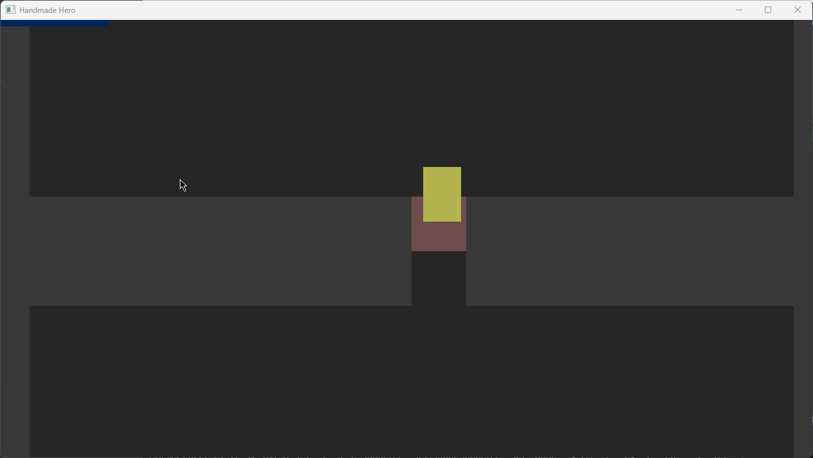
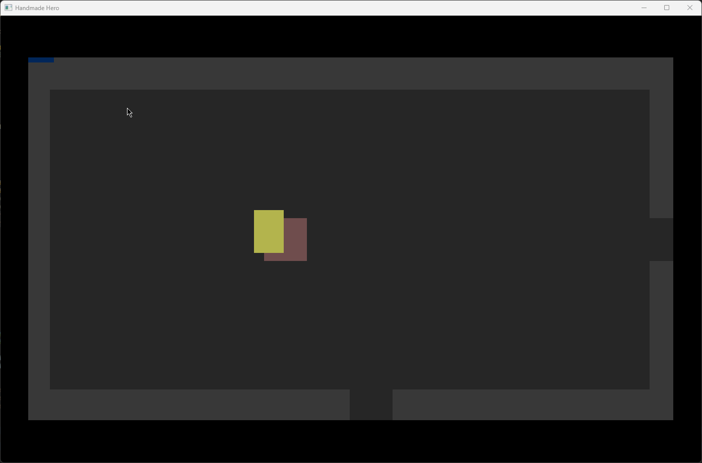
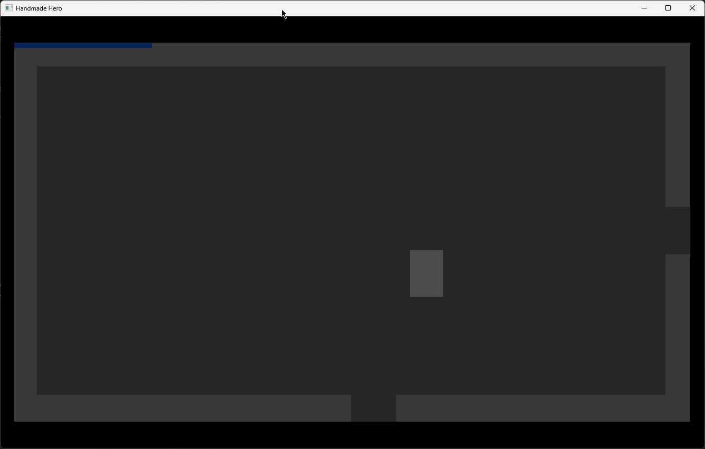
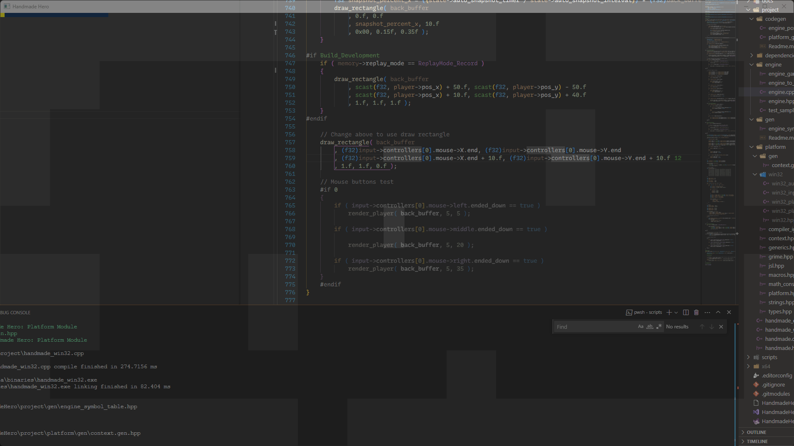
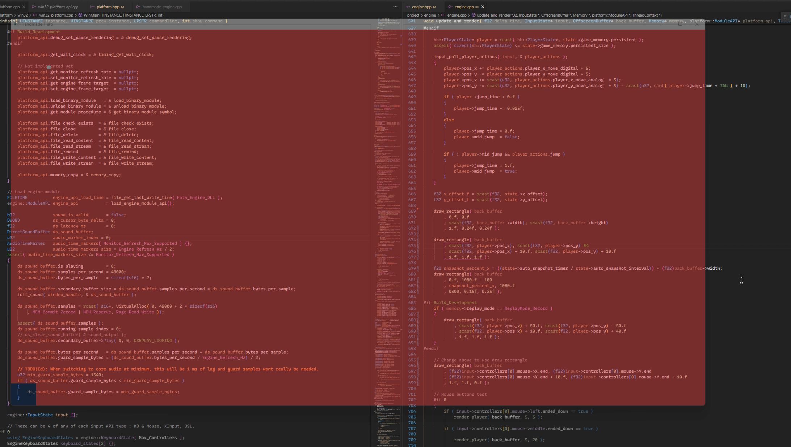

# HandmadeHero

Any code I do for this [series](https://handmadehero.org) will be here.

***(Only original hand-written code will be here, no code from the series itself)***

## Scripts

* `build.ps1` - Builds the project use `.\scripts\build msvc <args> <module>` or `.\scripts\build clang <args> <module>`
  * `debug` adds debug symbols, etc
  * `dev` for development builds. (automatically adds debug)
  * `optimize` for optimized builds.
  * `verbose` gives more info on arguments passed to tools, etc.
  * `module` is the module to build, can be any of `platform` or `engine` for this point in the codebase. (Eventually game will also be a separate module)
* `clean.ps1` - Cleans the project
* `update_deps.ps1` - Updates the project dependencies to their latest from their respective repos.

*Make sure to run `update_deps.ps1` before building for the first time.*

## Notes

Building requires msvc or llvm's clang + lld, and powershell 7

The build is done in two stages:

1. Build and run metaprogram to scan and generate dependent code for the module being built.
2. Build the the runtime for the module.

Module build order:

1. Engine
2. Platform

## Milestone

Day 33 : Virtualized Tile Maps

Features Done so far:

* Tailor made build system via powershell scripts
  * Supports building the repo with msvc or clang
  * Will only build a module if it detects changes (md5 is cached)
  * Can stage codegen metaprograms to run before building the module
    * Will automatically not run if app process is found (for engine module).
  * Can emit exported mangled symbols for the engine module for hot-reload with the platform module without needing to use C linkage symbols or a complex hot-reload library (Live++, etc).
* Platform Layer:
  * Direct Sound audio
  * Keyboard & Mouse Input via GetAsyncKeyState & Win32 window messagng
  * XInput controller support
  * Dualsense controller support via joyshock library
  * Software rendering via Win32 GDI
  * Instantaneous hot reload of engine module
  * Block Memory allocation via VirtualAlloc for engine module
  * Memory mapped files for engine & game snapshots.
* Engine Layer:
  * Take & load snapshots of either the engine's or game's memory state.
    * Allows for engine or game state to be restored even if a crash occurs to exact memory state it was before.
  * Basic input abstraction into hard-coded actions (``EngineActions` & `PlayerActions`)
  * Record & replay input.
  * (WIP) : 2D Tile Map setup

## Gallery

