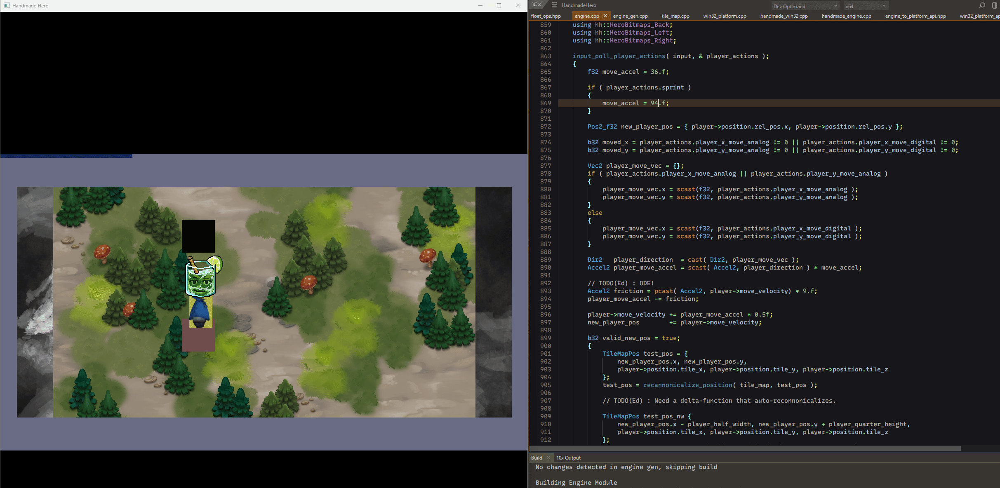
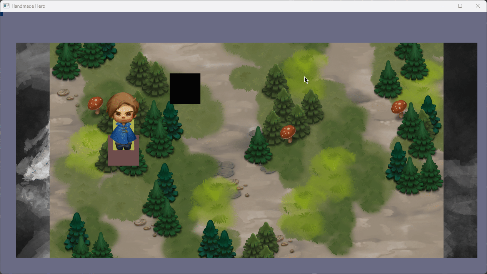
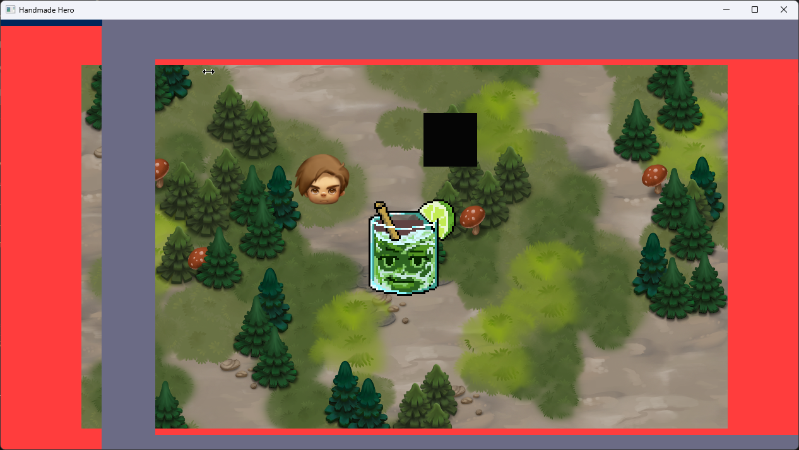
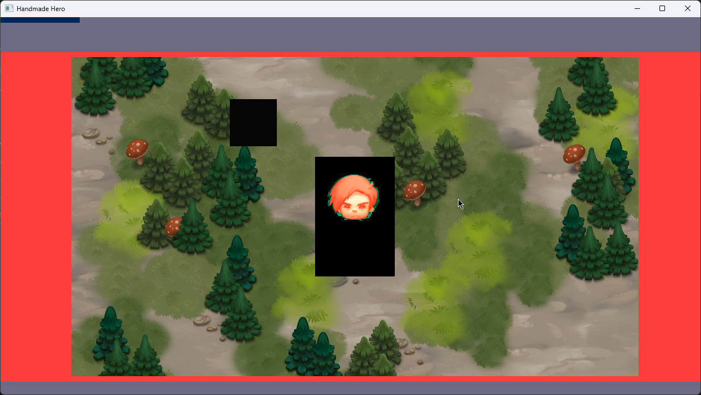
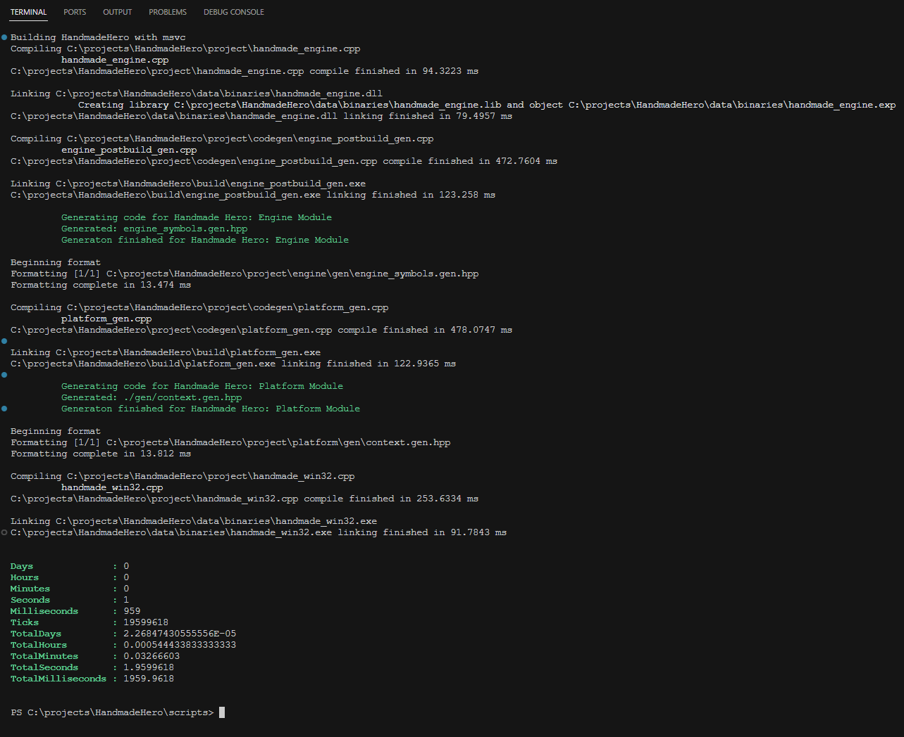
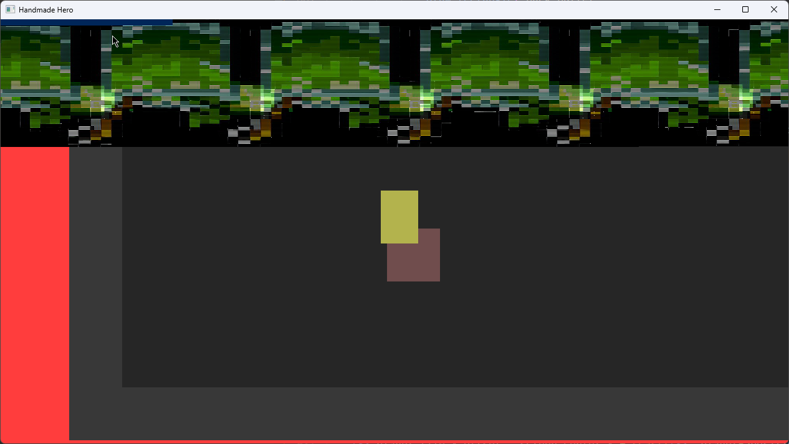
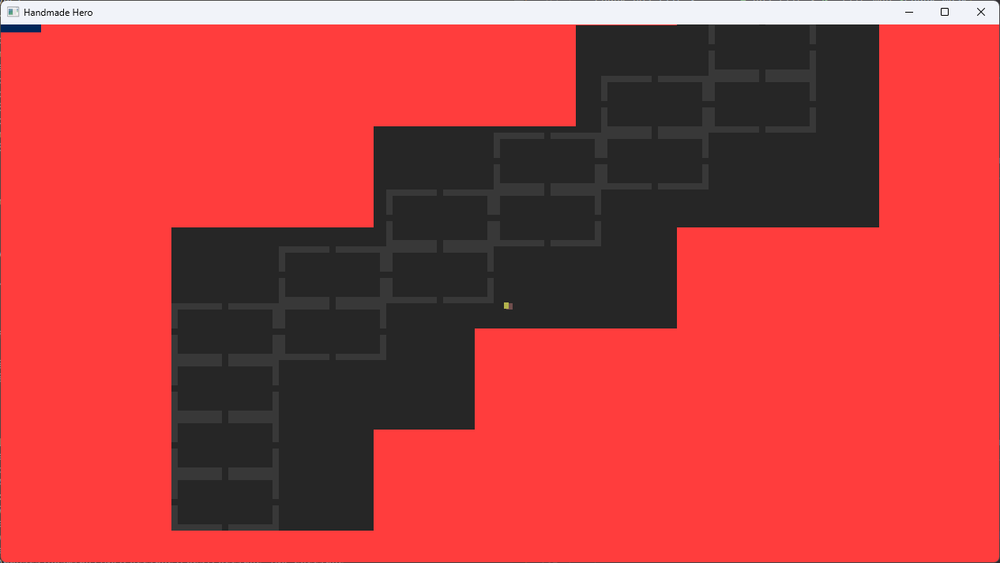
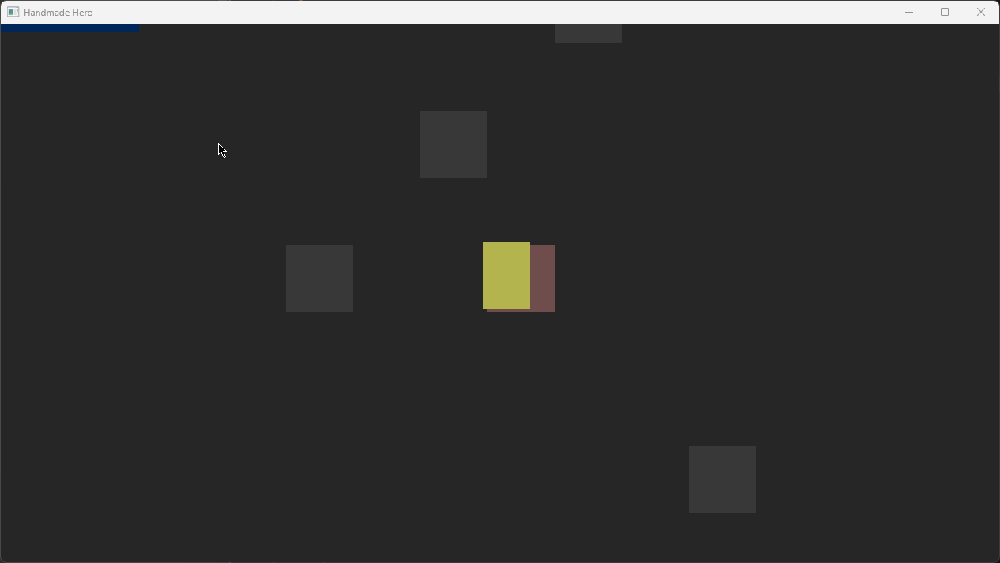

# HandmadeHero

Any code I do for this [series](https://handmadehero.org) will be here.

***(Only original hand-written code will be here, no code from the series itself)***

## Scripts

* `build.ps1` - Builds the project use `.\scripts\build msvc <args> <module>` or `.\scripts\build clang <args> <module>`
  * `debug` adds debug symbols, etc
  * `dev` for development builds. (automatically adds debug)
  * `optimize` for optimized builds.
  * `verbose` gives more info on arguments passed to tools, etc.
  * `module` is the module to build, can be any of `platform` or `engine` for this point in the codebase. (Eventually game will also be a separate module)
* `clean.ps1` - Cleans the project
* `update_deps.ps1` - Updates the project dependencies to their latest from their respective repos.

*Make sure to run `update_deps.ps1` before building for the first time.*

## Notes

Building requires msvc or llvm's clang + lld, and powershell 7

The build is done in the following stages (if clean build):

1. Build engine module
    1. Build and run pre-build metaprogram: engine_gen.cpp
    2. Build engine module dll.
    3. Build and run post-build metaprogram to generate engine symbol constants.
2. Build platform module
    1. Build and run pre-build metaprogram.
    2. Build platform module as executable

The final build order should have an additional game module: `handmade`, that will be dependent on the engine and platform modules.

## Milestone

Day 49 : Debugging Canonical Coordinatescl

Features Done so far:

* Tailor made build system via powershell scripts
  * Supports building the repo with msvc or clang
  * Will only build a module if it detects changes (md5 is cached)
    * Check is rudimentary can cannot detect all changes (headers for the most part)
    * Any changes to target should require a clean rebuild.
  * Can stage codegen metaprograms to run before building the module
    * Will automatically not run if app process is found (for engine module).
    * Metaprogramming library used was self-made from scratch: gencpp
  * Can emit exported mangled symbols for the engine module for hot-reload with the platform module without needing to use C linkage symbols or a complex hot-reload library (Live++, etc).
  * Project builds in less than 5 seconds. (Most of it is taken up by the metaprogramming library)
* Platform Layer:
  * Block Memory allocation via VirtualAlloc for engine module
  * Memory mapped files for engine & game snapshots.
  * Instantaneous hot reload of engine module
  * Software rendering via Win32 GDI
  * Direct Sound audio
  * Keyboard & Mouse Input via GetAsyncKeyState & Win32 window messagng
  * XInput controller support
  * Dualsense controller support via joyshock library
  * Fullscreen toggle
    * Can't change refresh rate
  * Auto-hide cursor in client region (painted surface), not using editor tools
* Engine Layer:
  * Take & load snapshots of either the engine's or game's memory state.
    * Allows for engine or game state to be restored even if a crash occurs to exact memory state it was before.
  * Basic input abstraction into hard-coded actions (``EngineActions` & `PlayerActions`)
  * Record & replay input.
  * WIP : 2.5D Tile Map
    * Virtualized into chunks
    * Some basic collision detection & math (pre-math coverage by Casey)
  * Bitmap file loading
    * Compression mode 3
    * Basic rendering
      * Linear alpha blending
      * Anchored to center position
  * Experimental type sytem for physics vectors.
  * Basic local co-op support
    * Each player can be assigned a controller
    * So far only support for two players
  * Camera assignable to follow arbitary entity

## Gallery

